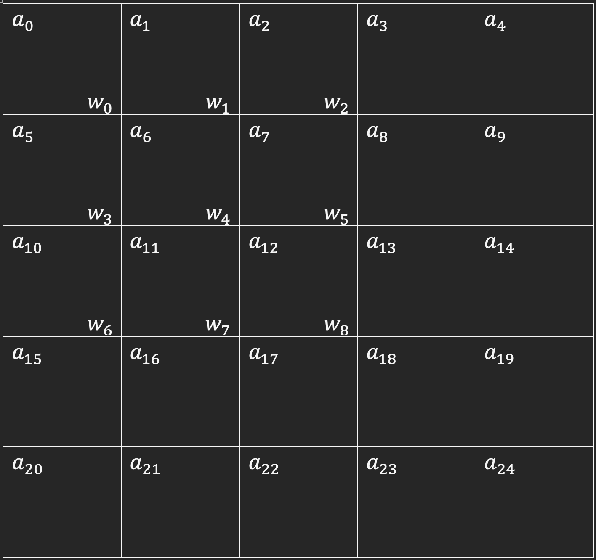
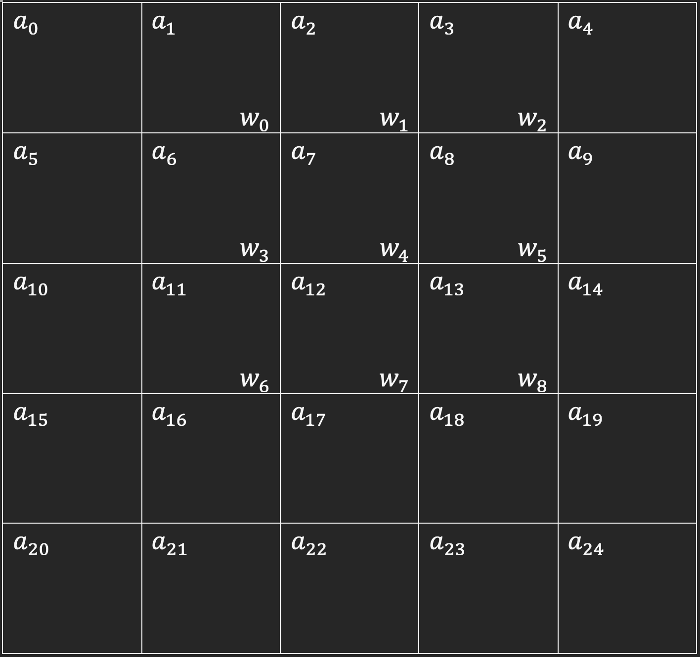
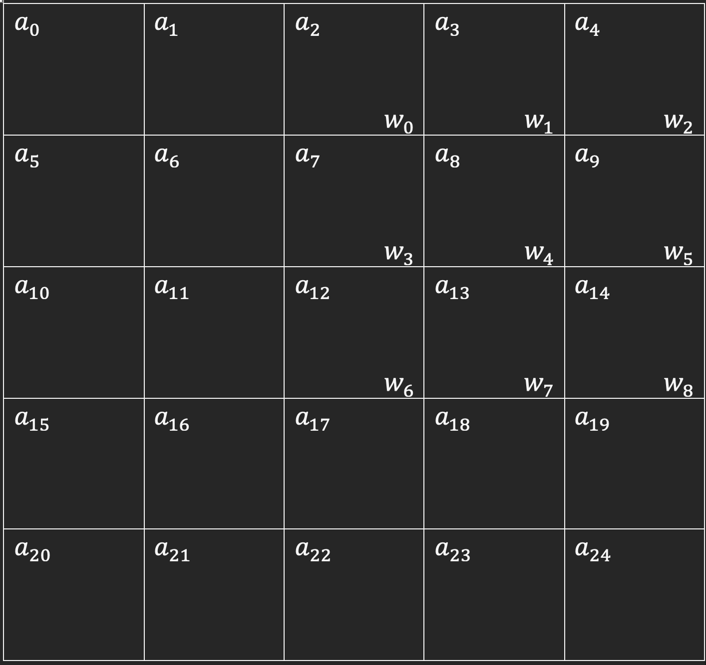
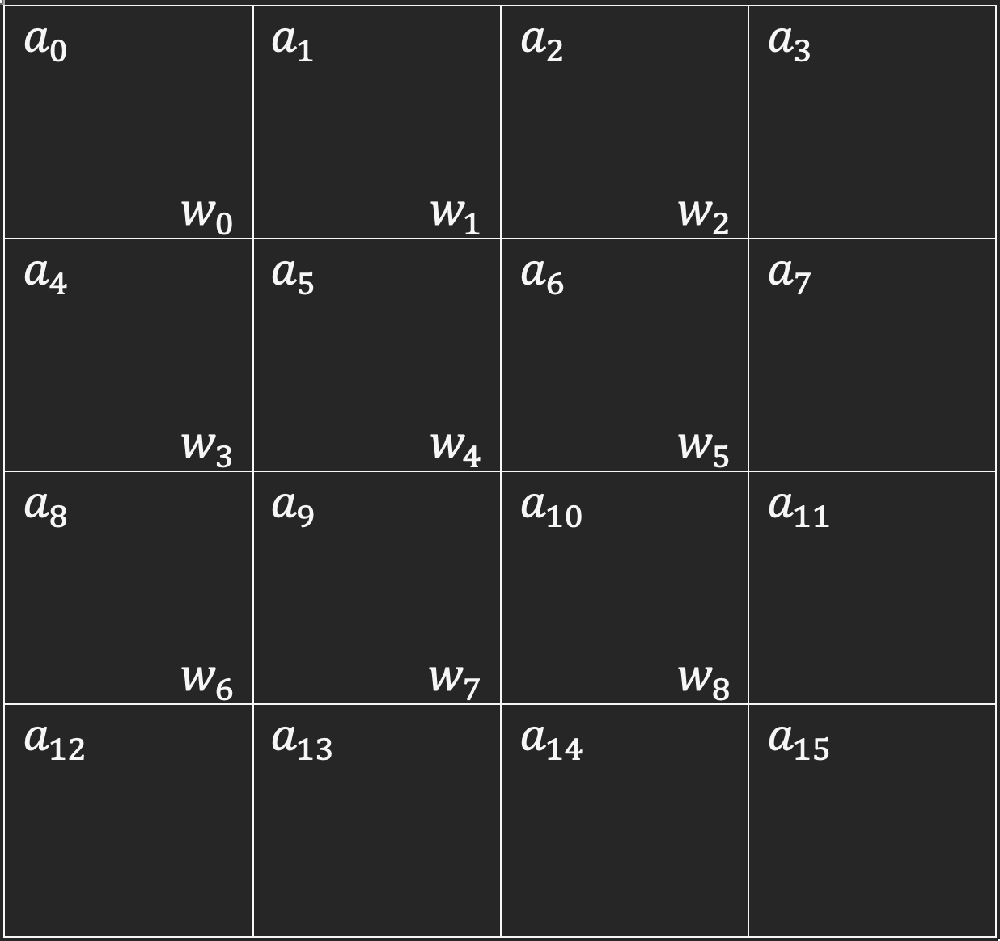
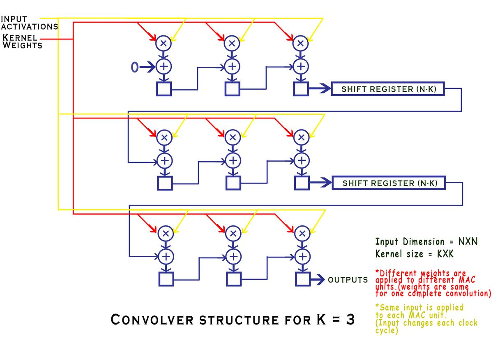

# Convolver
Document the development of Convolution Layer of CNN.

## Logic Verification in C++
- What is Convolution?
  - Explain the vanilla Convolution algorithm.
  - Specify the capability of our implementation
    - Timing analysis (How long does it take?)
    - How much hardware resource do we require?
    - What are the parameters that we allow to take in?
    - 
- Explain the algorithm: How does our convolution work? 
  - Use space-time tables to show the progression of data within the hardware.
- Describe the architecture
  - Active and Dormant Sections
    - How does the shift register array work?
    - What is every functional unit (MAC) calculating?
  - Where and why is the output located?
- Ways in which we've tested out algorithm
- Next steps

## What is Convolution?

In the Inference stage of Convolutional Neural Network (CNN), convolution operation is done to a given input (an image, for example) for the kernel to produce a feature map.

For the sake of our discussion, let's say there's an input image of size NxN, and we're using a KxK kernel to extract the image's features. Throughout the convolution process, the kernel "slides" across the image with step size of S (where S stands for stride).

Within the area of image where the kernel overlaps, element-wise muiltiplications are performed, and the results of all KxK multiplications are summed together to produce the final result for convolution.

The mathematical expression is detailed below:

$$
S(x, y) = \sum_{m} \sum_{n} I(x + m, y + n) \cdot K(m, n)
$$

Where:
- $S(x, y)$: The value of the resulting **feature map** at position $(x, y)$.
- $I(x, y)$: The input data (e.g., a 2D image or feature map).
- \( K(m, n) \): The filter (or kernel) with dimensions \(M \times N\).
- \( m, n \): Indices of the filter \(K\).
- The operation slides the kernel \(K\) over the input \(I\), performing element-wise multiplication and summing the results for each position.

---

### **Expanded Formula with Stride and Padding**
If you consider stride (\(s\)) and padding (\(p\)), the formula for the output size of the feature map becomes:

$$S(x, y) = \sum_{m=0}^{M-1} \sum_{n=0}^{N-1} I(x \cdot s + m, y \cdot s + n) \cdot K(m, n)$$

And the size of the resulting feature map \( (H_\text{out}, W_\text{out}) \) is:

\[
H_\text{out} = \frac{H_\text{in} - M + 2p}{s} + 1
\]
\[
W_\text{out} = \frac{W_\text{in} - N + 2p}{s} + 1
\]

Where:
- \( H_\text{in}, W_\text{in} \): Height and width of the input.
- \( M, N \): Height and width of the kernel.
- \( s \): Stride.
- \( p \): Padding size.

### Visualize convolution

Let's make life easier by just looking at how the kernel moves in the input image. In this example, our image is of size 5x5, and the kernel has a size of 3x3.

If the stride size (or step size), S, is 1, then the first two steps of the convolution would look something like the following:

|  |  |
|----------------------------------|----------------------------------|
| Step 1 | Step 2 |

In the figure above, the "a" indicates an element that belongs to the input image, where "w" indicates an element of the kernel. The result of convolution produced in the first step is:

$$S(0, 0) = (w_0*a_0) + (w_1*a_1) + (w_2*a_2) 
            + (w_3*a_4) + (w_4*a_5) + (w_5*a_6)
            + (w_6*a_8) + (w_7*a_9) + (w_8*a_{10})$$

Whereas in the second step, the kernel is shifted by 1 place because the S=1:

$$S(0, 1) = (w_0*a_1) + (w_1*a_2) + (w_2*a_3) 
            + (w_3*a_6) + (w_4*a_7) + (w_5*a_8)
            + (w_6*a_{11}) + (w_7*a_{12}) + (w_8*a_{13})$$

Notice that the image still has one more column on the right where the kernel could move to. This means the output matrix will have 3 elements per row.

By similar logic, we can see that the kernel can move 2 steps down the image, so there are 3 elements per column in the output matrix.

As a result, the resulting output matrix has the size of 3x3.

Let's look at the scenario where the stride size, S, is NOT 1. For example, if S=2, the first two steps would look like below:

|  |  |
|----------------------------------|----------------------------------|
| Step 1 | Step 2 |

Notice that the second step when S=1 is skipped, and we landed the kernel straight in the right-most position in the input image. This is the direct result of have a stride of 2.

So, each row of the output matrix will only have 2 elements instead of 3. The same goes for the number of rows in total. This means the output matrix will have a size of 2x2.

## How does our implementation work?

Instead of placing the kernel on top of the input matrix and produce the output by summing up the result of multiplication in every cell in the table like how we discussed above, we are going to create the hardware component for each multiplication and summation, and feed each element in the input matrix one buy one.

Firstly, I have to pay tribute to the blog post that inspired this implementation: https://thedatabus.in/convolver

To better explain the algorithm, let's look at a simpler scenario where out input image only has a size of 4x4, and the kernel remain 3x3. As a result, the first of the convolution algorithm will look like below:

In the explanation of the algorithm, the author included a great visualization of the architecture for the case where N=4, K=3 (The case of our discussion). I've included it below:

Basically, there are as many "muliply and add the result to the running sum" units as the total number of kernels (KxK). We call theses units MAC (Multiply-Accumulate) units.

In each clock, an element of the input matrix is fed to ALL KxK MACs. In another word, at any given clock cycle, all MACs are provided with the SAME element of the Input matrix.

As a result, the algorithm would run as shown in the table below. 

| Spatial→ Temporal↓ | $W_{0}$ | $W_{1}$ | $W_{2}$ | $W_{3}$ | $W_{4}$ | $W_{5}$ | $W_{6}$ | $W_{7}$ | $W_{8}$ |
| --- | --- | --- | --- | --- | --- | --- | --- | --- | --- |
| $a_{0}$ | $S_{(0, 0)} + W_{0} \times a_{0}$ | $S_{(1, 0)} + W_{1} \times a_{0}$ | $S_{(2, 0)} + W_{2} \times a_{0}$ | $S_{(3, 0)} + W_{3} \times a_{0}$ | $S_{(4, 0)} + W_{4} \times a_{0}$ | $S_{(5, 0)} + W_{5} \times a_{0}$ | $S_{(6, 0)} + W_{6} \times a_{0}$ | $S_{(7, 0)} + W_{7} \times a_{0}$ | $S_{(8, 0)} + W_{8} \times a_{0}$ |
| $a_{1}$ | $S_{(0, 1)} + W_{0} \times a_{1}$ | $S_{(1, 1)} + W_{1} \times a_{1}$ | $S_{(2, 1)} + W_{2} \times a_{1}$ | $S_{(3, 1)} + W_{3} \times a_{1}$ | $S_{(4, 1)} + W_{4} \times a_{1}$ | $S_{(5, 1)} + W_{5} \times a_{1}$ | $S_{(6, 1)} + W_{6} \times a_{1}$ | $S_{(7, 1)} + W_{7} \times a_{1}$ | $S_{(8, 1)} + W_{8} \times a_{1}$ |
| $a_{2}$ | $S_{(0, 2)} + W_{0} \times a_{2}$ | $S_{(1, 2)} + W_{1} \times a_{2}$ | $S_{(2, 2)} + W_{2} \times a_{2}$ | $S_{(3, 2)} + W_{3} \times a_{2}$ | $S_{(4, 2)} + W_{4} \times a_{2}$ | $S_{(5, 2)} + W_{5} \times a_{2}$ | $S_{(6, 2)} + W_{6} \times a_{2}$ | $S_{(7, 2)} + W_{7} \times a_{2}$ | $S_{(8, 2)} + W_{8} \times a_{2}$ |
| $a_{3}$ | $S_{(0, 3)} + W_{0} \times a_{3}$ | $S_{(1, 3)} + W_{1} \times a_{3}$ | $S_{(2, 3)} + W_{2} \times a_{3}$ | $S_{(3, 3)} + W_{3} \times a_{3}$ | $S_{(4, 3)} + W_{4} \times a_{3}$ | $S_{(5, 3)} + W_{5} \times a_{3}$ | $S_{(6, 3)} + W_{6} \times a_{3}$ | $S_{(7, 3)} + W_{7} \times a_{3}$ | $S_{(8, 3)} + W_{8} \times a_{3}$ |
| $a_{4}$ | $S_{(0, 4)} + W_{0} \times a_{4}$ | $S_{(1, 4)} + W_{1} \times a_{4}$ | $S_{(2, 4)} + W_{2} \times a_{4}$ | $S_{(3, 4)} + W_{3} \times a_{4}$ | $S_{(4, 4)} + W_{4} \times a_{4}$ | $S_{(5, 4)} + W_{5} \times a_{4}$ | $S_{(6, 4)} + W_{6} \times a_{4}$ | $S_{(7, 4)} + W_{7} \times a_{4}$ | $S_{(8, 4)} + W_{8} \times a_{4}$ |
| $a_{5}$ | $S_{(0, 5)} + W_{0} \times a_{5}$ | $S_{(1, 5)} + W_{1} \times a_{5}$ | $S_{(2, 5)} + W_{2} \times a_{5}$ | $S_{(3, 5)} + W_{3} \times a_{5}$ | $S_{(4, 5)} + W_{4} \times a_{5}$ | $S_{(5, 5)} + W_{5} \times a_{5}$ | $S_{(6, 5)} + W_{6} \times a_{5}$ | $S_{(7, 5)} + W_{7} \times a_{5}$ | $S_{(8, 5)} + W_{8} \times a_{5}$ |
| $a_{6}$ | $S_{(0, 6)} + W_{0} \times a_{6}$ | $S_{(1, 6)} + W_{1} \times a_{6}$ | $S_{(2, 6)} + W_{2} \times a_{6}$ | $S_{(3, 6)} + W_{3} \times a_{6}$ | $S_{(4, 6)} + W_{4} \times a_{6}$ | $S_{(5, 6)} + W_{5} \times a_{6}$ | $S_{(6, 6)} + W_{6} \times a_{6}$ | $S_{(7, 6)} + W_{7} \times a_{6}$ | $S_{(8, 6)} + W_{8} \times a_{6}$ |
| $a_{7}$ | $S_{(0, 7)} + W_{0} \times a_{7}$ | $S_{(1, 7)} + W_{1} \times a_{7}$ | $S_{(2, 7)} + W_{2} \times a_{7}$ | $S_{(3, 7)} + W_{3} \times a_{7}$ | $S_{(4, 7)} + W_{4} \times a_{7}$ | $S_{(5, 7)} + W_{5} \times a_{7}$ | $S_{(6, 7)} + W_{6} \times a_{7}$ | $S_{(7, 7)} + W_{7} \times a_{7}$ | $S_{(8, 7)} + W_{8} \times a_{7}$ |
| $a_{8}$ | $S_{(0, 8)} + W_{0} \times a_{8}$ | $S_{(1, 8)} + W_{1} \times a_{8}$ | $S_{(2, 8)} + W_{2} \times a_{8}$ | $S_{(3, 8)} + W_{3} \times a_{8}$ | $S_{(4, 8)} + W_{4} \times a_{8}$ | $S_{(5, 8)} + W_{5} \times a_{8}$ | $S_{(6, 8)} + W_{6} \times a_{8}$ | $S_{(7, 8)} + W_{7} \times a_{8}$ | $S_{(8, 8)} + W_{8} \times a_{8}$ |
| $a_{9}$ | $S_{(0, 9)} + W_{0} \times a_{9}$ | $S_{(1, 9)} + W_{1} \times a_{9}$ | $S_{(2, 9)} + W_{2} \times a_{9}$ | $S_{(3, 9)} + W_{3} \times a_{9}$ | $S_{(4, 9)} + W_{4} \times a_{9}$ | $S_{(5, 9)} + W_{5} \times a_{9}$ | $S_{(6, 9)} + W_{6} \times a_{9}$ | $S_{(7, 9)} + W_{7} \times a_{9}$ | $S_{(8, 9)} + W_{8} \times a_{9}$ |
| $a_{10}$ | $S_{(0, 10)} + W_{0} \times a_{10}$ | $S_{(1, 10)} + W_{1} \times a_{10}$ | $S_{(2, 10)} + W_{2} \times a_{10}$ | $S_{(3, 10)} + W_{3} \times a_{10}$ | $S_{(4, 10)} + W_{4} \times a_{10}$ | $S_{(5, 10)} + W_{5} \times a_{10}$ | $S_{(6, 10)} + W_{6} \times a_{10}$ | $S_{(7, 10)} + W_{7} \times a_{10}$ | $S_{(8, 10)} + W_{8} \times a_{10}$ |
| $a_{11}$ | $S_{(0, 11)} + W_{0} \times a_{11}$ | $S_{(1, 11)} + W_{1} \times a_{11}$ | $S_{(2, 11)} + W_{2} \times a_{11}$ | $S_{(3, 11)} + W_{3} \times a_{11}$ | $S_{(4, 11)} + W_{4} \times a_{11}$ | $S_{(5, 11)} + W_{5} \times a_{11}$ | $S_{(6, 11)} + W_{6} \times a_{11}$ | $S_{(7, 11)} + W_{7} \times a_{11}$ | $S_{(8, 11)} + W_{8} \times a_{11}$ |
| $a_{12}$ | $S_{(0, 12)} + W_{0} \times a_{12}$ | $S_{(1, 12)} + W_{1} \times a_{12}$ | $S_{(2, 12)} + W_{2} \times a_{12}$ | $S_{(3, 12)} + W_{3} \times a_{12}$ | $S_{(4, 12)} + W_{4} \times a_{12}$ | $S_{(5, 12)} + W_{5} \times a_{12}$ | $S_{(6, 12)} + W_{6} \times a_{12}$ | $S_{(7, 12)} + W_{7} \times a_{12}$ | $S_{(8, 12)} + W_{8} \times a_{12}$ |
| $a_{13}$ | $S_{(0, 13)} + W_{0} \times a_{13}$ | $S_{(1, 13)} + W_{1} \times a_{13}$ | $S_{(2, 13)} + W_{2} \times a_{13}$ | $S_{(3, 13)} + W_{3} \times a_{13}$ | $S_{(4, 13)} + W_{4} \times a_{13}$ | $S_{(5, 13)} + W_{5} \times a_{13}$ | $S_{(6, 13)} + W_{6} \times a_{13}$ | $S_{(7, 13)} + W_{7} \times a_{13}$ | $S_{(8, 13)} + W_{8} \times a_{13}$ |
| $a_{14}$ | $S_{(0, 14)} + W_{0} \times a_{14}$ | $S_{(1, 14)} + W_{1} \times a_{14}$ | $S_{(2, 14)} + W_{2} \times a_{14}$ | $S_{(3, 14)} + W_{3} \times a_{14}$ | $S_{(4, 14)} + W_{4} \times a_{14}$ | $S_{(5, 14)} + W_{5} \times a_{14}$ | $S_{(6, 14)} + W_{6} \times a_{14}$ | $S_{(7, 14)} + W_{7} \times a_{14}$ | $S_{(8, 14)} + W_{8} \times a_{14}$ |
| $a_{15}$ | $S_{(0, 15)} + W_{0} \times a_{15}$ | $S_{(1, 15)} + W_{1} \times a_{15}$ | $S_{(2, 15)} + W_{2} \times a_{15}$ | $S_{(3, 15)} + W_{3} \times a_{15}$ | $S_{(4, 15)} + W_{4} \times a_{15}$ | $S_{(5, 15)} + W_{5} \times a_{15}$ | $S_{(6, 15)} + W_{6} \times a_{15}$ | $S_{(7, 15)} + W_{7} \times a_{15}$ | $S_{(8, 15)} + W_{8} \times a_{15}$ |

The spatial axis that runs from $W_0$ to $W_9$ represents the $3 \times 3 = 9$ kernel weights. They are considered "spatial" because each weight is hard-coded in its respective MAC unit.

The temporal axis that runs from $a_0$ to $a_{15}$ represents the $4 \times 4 = 16$ input image pixels. They are considered "temporal" because each pixel is provided to all MAC units at the beginning of each clock period.

As a result, the $x$th MAC unit will perform the following computation: $S_{(x,y)} + W_x \times a_y$ in the $y$th clock cycle, where $S_{(x,y)}$ is the running sum that is provided to the MAC unit, $W_x$ is the kernel weight value hardcoded in the MAC unit, and $a_y$ is the $y$th input image matrix.

As we can see from every row of the table, at the end of each clock period, 9 running sums are produced by the 9 MAC units. The question is, where should each of those 9 MAC units send their running sums to?

To answer this question, let's look at the first step of the convolution again.

Remember that each step of the convolution produces an element of the output matrix. Let's assume that we only consider the case when stride is 1. Notice that from the first step, we can move 1 step to the right, and 1 step to the bottom. So, there are a total of 4 locations where we can fit our kernel on the input image matrix. This means our output matrix will have the size of $2\times2=4$.

In the first step, the output that we want to produce is:
$W_0 \times a_0 + W_1 \times a_1 + W_2 \times a_2 + W_3 \times a_4 + W_4 \times a_5 + W_5 \times a_6 + W_6 \times a_8 + W_7 \times a_9 + W_8 \times a_10$

Notice that for the first row, $W_0 \times a_0 + W_1 \times a_1 + W_2 \times a_2$, we just have to forward the output of the 0th MAC as the input running sum of the 1st MAC, because the value of $a_1$ would be provided in clock 1. For the same reason, the output of the 1st MAC as the input running sum of the 2nd MAC.

However, this wouldn't apply to the next MAC, which would possess the kernel value of $W_3$, because, as the formula has shown, it needs the value of $a_4$. To get the value of $a_4$, the 3rd MAC will have to get to clock 4 to produce its correct sum. This happens because the size of the input image matrix is 4x4, while the kernel's size is 3x3. So, after every row of convolution, the following start-of-the-row MAC has to wait for $4-3=1$ clock to get its correct input matrix value.

But where does a start-of-the-row MAC get its input running sum from? For the previous scenario, the output of the first row is $W_0 \times a_0 + W_1 \times a_1 + W_2 \times a_2$. Like any sequential circuit, without registering, its value will be gone. In the immediate clock after $W_0 \times a_0 + W_1 \times a_1 + W_2 \times a_2$, it would've been gone. Since we want it to stay for $4-3=1$ clock, we need $4-3=1$ shift registers. Since every start-of-the-row MAC will face this issue (except the 0th one of course), every row will need $4-3=1$ shift registers after the end-of-the-row MAC. To generalize this, if the input image matrix has the size of NxN, and the kernel has the size of KxK, then we need (N-K) shift registers for every row except the very last one, where the output of the convolution is produced. You can find the shift registers in the architecture diagram earlier in this passage too.

### Computation Thread

The table below shows how each output matrix's element was calculated. Please note that each thread is highlighted with a unique color specified in the legend below.

| Highlight Color | Output Matrix Element |
|-------|---------|
|  | (0, 0) |
|  | (0, 1) |
|  | (1, 0) |
|  | (1, 1) |

To follow a particular thread, simply follow the output matrix element's highlighting color from the top of the table to the bottom (in temporal order).

Notice that the yellow thread is identical to the one that we've focused our dicussion on previously. That thread, as mentioned, produces the top left (0,0) element of the output matrix.

|  | $W_{0}$ | $W_{1}$ | $W_{2}$ | $W_{3}$ | $W_{4}$ | $W_{5}$ | $W_{6}$ | $W_{7}$ | $W_{8}$ |
| --- | --- | --- | --- | --- | --- | --- | --- | --- | --- |
| $a_{0}$ | <mark style='background-color: rgb(255, 255, 0); color: black;'>$0 + W_{0} * a_{0}$</mark> | $+ W_{1} * a_{0}$ | $+ W_{2} * a_{0}$ | $+ W_{3} * a_{0}$ | $+ W_{4} * a_{0}$ | $+ W_{5} * a_{0}$ | $+ W_{6} * a_{0}$ | $+ W_{7} * a_{0}$ | $+ W_{8} * a_{0}$ |
| $a_{1}$ | <mark style='background-color: rgb(127, 255, 0); color: black;'>$0 + W_{0} * a_{1}$</mark> | <mark style='background-color: rgb(255, 255, 0); color: black;'>$+ W_{1} * a_{1}$</mark> | $+ W_{2} * a_{1}$ | $+ W_{3} * a_{1}$ | $+ W_{4} * a_{1}$ | $+ W_{5} * a_{1}$ | $+ W_{6} * a_{1}$ | $+ W_{7} * a_{1}$ | $+ W_{8} * a_{1}$ |
| $a_{2}$ | $0 + W_{0} * a_{2}$ | <mark style='background-color: rgb(127, 255, 0); color: black;'>$+ W_{1} * a_{2}$</mark> | <mark style='background-color: rgb(255, 255, 0); color: black;'>$+ W_{2} * a_{2}$</mark> | $+ W_{3} * a_{2}$ | $+ W_{4} * a_{2}$ | $+ W_{5} * a_{2}$ | $+ W_{6} * a_{2}$ | $+ W_{7} * a_{2}$ | $+ W_{8} * a_{2}$ |
| $a_{3}$ | $0 + W_{0} * a_{3}$ | $+ W_{1} * a_{3}$ | <mark style='background-color: rgb(127, 255, 0); color: black;'>$+ W_{2} * a_{3}$</mark> | $+ W_{3} * a_{3}$ | $+ W_{4} * a_{3}$ | $+ W_{5} * a_{3}$ | $+ W_{6} * a_{3}$ | $+ W_{7} * a_{3}$ | $+ W_{8} * a_{3}$ |
| $a_{4}$ | <mark style='background-color: rgb(191, 255, 0); color: black;'>$0 + W_{0} * a_{4}$</mark> | $+ W_{1} * a_{4}$ | $+ W_{2} * a_{4}$ | <mark style='background-color: rgb(255, 255, 0); color: black;'>$+ W_{3} * a_{4}$</mark> | $+ W_{4} * a_{4}$ | $+ W_{5} * a_{4}$ | $+ W_{6} * a_{4}$ | $+ W_{7} * a_{4}$ | $+ W_{8} * a_{4}$ |
| $a_{5}$ | <mark style='background-color: rgb(63, 255, 0); color: black;'>$0 + W_{0} * a_{5}$</mark> | <mark style='background-color: rgb(191, 255, 0); color: black;'>$+ W_{1} * a_{5}$</mark> | $+ W_{2} * a_{5}$ | <mark style='background-color: rgb(127, 255, 0); color: black;'>$+ W_{3} * a_{5}$</mark> | <mark style='background-color: rgb(255, 255, 0); color: black;'>$+ W_{4} * a_{5}$</mark> | $+ W_{5} * a_{5}$ | $+ W_{6} * a_{5}$ | $+ W_{7} * a_{5}$ | $+ W_{8} * a_{5}$ |
| $a_{6}$ | $0 + W_{0} * a_{6}$ | <mark style='background-color: rgb(63, 255, 0); color: black;'>$+ W_{1} * a_{6}$</mark> | <mark style='background-color: rgb(191, 255, 0); color: black;'>$+ W_{2} * a_{6}$</mark> | $+ W_{3} * a_{6}$ | <mark style='background-color: rgb(127, 255, 0); color: black;'>$+ W_{4} * a_{6}$</mark> | <mark style='background-color: rgb(255, 255, 0); color: black;'>$+ W_{5} * a_{6}$</mark> | $+ W_{6} * a_{6}$ | $+ W_{7} * a_{6}$ | $+ W_{8} * a_{6}$ |
| $a_{7}$ | $0 + W_{0} * a_{7}$ | $+ W_{1} * a_{7}$ | <mark style='background-color: rgb(63, 255, 0); color: black;'>$+ W_{2} * a_{7}$</mark> | $+ W_{3} * a_{7}$ | $+ W_{4} * a_{7}$ | <mark style='background-color: rgb(127, 255, 0); color: black;'>$+ W_{5} * a_{7}$</mark> | $+ W_{6} * a_{7}$ | $+ W_{7} * a_{7}$ | $+ W_{8} * a_{7}$ |
| $a_{8}$ | $0 + W_{0} * a_{8}$ | $+ W_{1} * a_{8}$ | $+ W_{2} * a_{8}$ | <mark style='background-color: rgb(191, 255, 0); color: black;'>$+ W_{3} * a_{8}$</mark> | $+ W_{4} * a_{8}$ | $+ W_{5} * a_{8}$ | <mark style='background-color: rgb(255, 255, 0); color: black;'>$+ W_{6} * a_{8}$</mark> | $+ W_{7} * a_{8}$ | $+ W_{8} * a_{8}$ |
| $a_{9}$ | $0 + W_{0} * a_{9}$ | $+ W_{1} * a_{9}$ | $+ W_{2} * a_{9}$ | <mark style='background-color: rgb(63, 255, 0); color: black;'>$+ W_{3} * a_{9}$</mark> | <mark style='background-color: rgb(191, 255, 0); color: black;'>$+ W_{4} * a_{9}$</mark> | $+ W_{5} * a_{9}$ | <mark style='background-color: rgb(127, 255, 0); color: black;'>$+ W_{6} * a_{9}$</mark> | <mark style='background-color: rgb(255, 255, 0); color: black;'>$+ W_{7} * a_{9}$</mark> | $+ W_{8} * a_{9}$ |
| $a_{10}$ | $0 + W_{0} * a_{10}$ | $+ W_{1} * a_{10}$ | $+ W_{2} * a_{10}$ | $+ W_{3} * a_{10}$ | <mark style='background-color: rgb(63, 255, 0); color: black;'>$+ W_{4} * a_{10}$</mark> | <mark style='background-color: rgb(191, 255, 0); color: black;'>$+ W_{5} * a_{10}$</mark> | $+ W_{6} * a_{10}$ | <mark style='background-color: rgb(127, 255, 0); color: black;'>$+ W_{7} * a_{10}$</mark> | <mark style='background-color: rgb(255, 255, 0); color: black;'>$+ W_{8} * a_{10}$</mark> |
| $a_{11}$ | $0 + W_{0} * a_{11}$ | $+ W_{1} * a_{11}$ | $+ W_{2} * a_{11}$ | $+ W_{3} * a_{11}$ | $+ W_{4} * a_{11}$ | <mark style='background-color: rgb(63, 255, 0); color: black;'>$+ W_{5} * a_{11}$</mark> | $+ W_{6} * a_{11}$ | $+ W_{7} * a_{11}$ | <mark style='background-color: rgb(127, 255, 0); color: black;'>$+ W_{8} * a_{11}$</mark> |
| $a_{12}$ | $0 + W_{0} * a_{12}$ | $+ W_{1} * a_{12}$ | $+ W_{2} * a_{12}$ | $+ W_{3} * a_{12}$ | $+ W_{4} * a_{12}$ | $+ W_{5} * a_{12}$ | <mark style='background-color: rgb(191, 255, 0); color: black;'>$+ W_{6} * a_{12}$</mark> | $+ W_{7} * a_{12}$ | $+ W_{8} * a_{12}$ |
| $a_{13}$ | $0 + W_{0} * a_{13}$ | $+ W_{1} * a_{13}$ | $+ W_{2} * a_{13}$ | $+ W_{3} * a_{13}$ | $+ W_{4} * a_{13}$ | $+ W_{5} * a_{13}$ | <mark style='background-color: rgb(63, 255, 0); color: black;'>$+ W_{6} * a_{13}$</mark> | <mark style='background-color: rgb(191, 255, 0); color: black;'>$+ W_{7} * a_{13}$</mark> | $+ W_{8} * a_{13}$ |
| $a_{14}$ | $0 + W_{0} * a_{14}$ | $+ W_{1} * a_{14}$ | $+ W_{2} * a_{14}$ | $+ W_{3} * a_{14}$ | $+ W_{4} * a_{14}$ | $+ W_{5} * a_{14}$ | $+ W_{6} * a_{14}$ | <mark style='background-color: rgb(63, 255, 0); color: black;'>$+ W_{7} * a_{14}$</mark> | <mark style='background-color: rgb(191, 255, 0); color: black;'>$+ W_{8} * a_{14}$</mark> |
| $a_{15}$ | $0 + W_{0} * a_{15}$ | $+ W_{1} * a_{15}$ | $+ W_{2} * a_{15}$ | $+ W_{3} * a_{15}$ | $+ W_{4} * a_{15}$ | $+ W_{5} * a_{15}$ | $+ W_{6} * a_{15}$ | $+ W_{7} * a_{15}$ | <mark style='background-color: rgb(63, 255, 0); color: black;'>$+ W_{8} * a_{15}$</mark> |

### Summary

In terms of space, we need KxK MAC units and (K-1)*(N-K) shift registers in out circuit to perform all computations. Since each MAC unit require a register anyway, we will need KxK multipliers and adders, in addition to K * (N-K) + K registers.

In terms of time, we need to feed every input matrix's element to the circuit, so we require NxN clock periods to produce all elements of the output matrix.