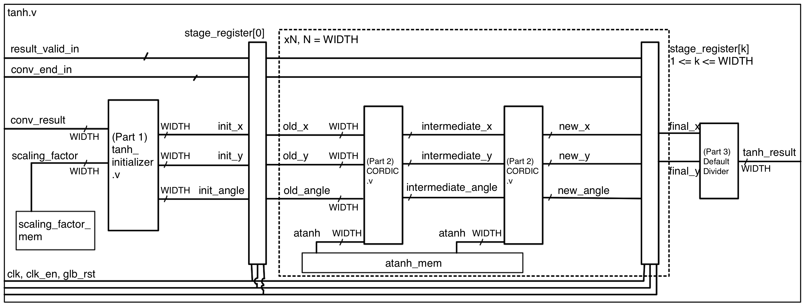
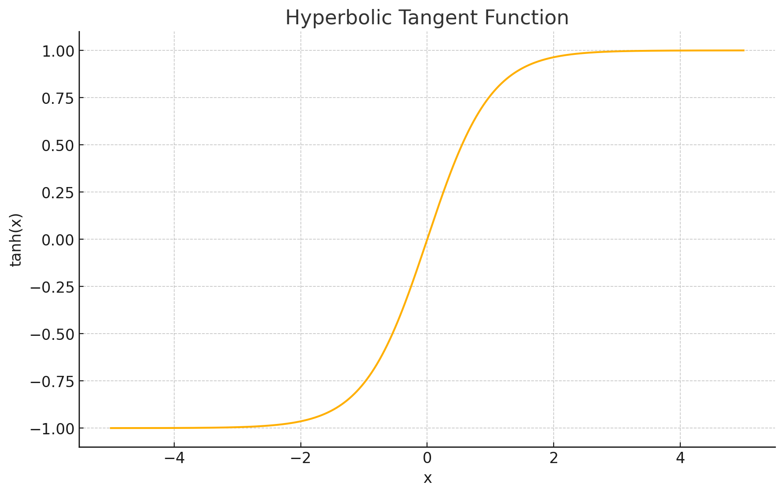

# Hyperbolic Tangent Non-Linearity powered by CORDIC Algorithm
Document the development of Non-Linearity of CNN. The Verilog implementation can be found [here](../tanh.v).

<!-- ## Game Plan
- Explain what non-linearity is:
  - If we don't have a non-linearity, then all the layers can simply be reduced to a single linear operation...
  - How does non-linearity solves this issue?
  - What is Hyperbolic Tangent?
    - What does its graph look like?
- How to implement tanh in an FPGA accelerator?
  - Explain the necessity of pipelining.
  - Introduce CORDIC Algorithm.
- CORDIC:
  - Derivation of CORDIC for tanh
  - Adapting the CORDIC algorithm into pipeline stages.
    - Introduce what each stage should be doing
- (Include a figure showcasing the overall architecture)
- Explain what each module is doing. (some of them with figures) -->

## Overall Pipeline Architecture



## What is Non-Linearity?

### Why do we need Non-Linearity at all?

Remember in the discussion of [Convolution Layer](./convolver.pdf), we mentioned that the operation of convolver can be summarized to the following lineary operation:

$$
\mathbf{y} = W \mathbf{x} + b
$$

Now imagine that we are trying build a deep CNN that involves multiple Convolution Layer stacked one after another. Without any non-linearity, the resulting operation will simply be the following:

$$
\mathbf{y} = W_{2}\bigl(W_{1}\mathbf{x} + b_{1}\bigr) + b_{2}
= (W_{2}W_{1})\,\mathbf{x} + \bigl(W_{2}b_{1} + b_{2}\bigr)
$$

Notice that $(W_{2}W_{1})$ and $(W_{2}b_{1} + b_{2})$ are both products of constants. This means our deep Neural Network pipeline that features multiple Convolution Layers is being erroneously reduced to a single layer.

### How does Non-Linearity help?

To avoid this phenomenon, we need to introduce a non-linear function $f(⋅)$, which is basically a function that is NOT in the form of $ax+c$.

By inserting the result of each Convolution Layer into the non-linearity $f$, we get a value that cannot be simplified to a linear operation like $ax+c$, and hence avoiding the chain of linear operations that can be reduced to a single one.

### Which Non-Linearity should we choose?

The following non-linearities are often chosen:

**ReLU activation**  
$$
\mathrm{ReLU}(x) = \max\bigl(0,\,x\bigr)
$$

**Sigmoid activation**  
$$
\sigma(x) = \frac{1}{1 + e^{-x}}
$$

**Tanh activation**  
$$
\tanh(x) = \frac{e^{x} - e^{-x}}{e^{x} + e^{-x}}
$$

In terms of the ease of implementation in FPGA or ASIC, we should choose ReLU. This is because it simply require a comparator, where its result goes to a mux to select either 0 or the input as the output. But because it's too easy, let's take on the challenge of implementing Hyperbolic Tangent. 

Hyperbolic Tangent (let's refer it by tanh from now on for the sake of abbreviation) has a graph shown below. Basically it "squeeze" any real number to a number between -1 and 1.




## Implementation

Now let's look at what I've brought us into. Looking at the equation above, we see two very temporally expensive operations:
- Exponentials ($e^{x}$ and $e^{-x}$)
- Division

Implementing those with high precision demands large lookup tables, floating-point or fixed-point multipliers/dividers, and complex control—eating up DSP blocks and LUTs, and making it hard to achieve a deep, high-frequency pipeline.

Introducing CORDIC, an algorithm that will enable us to calculate tanh with roughly only the following resources:
- Adders/Subtractors
- Bit-shift operations
- A small table of pre-computed “angle” constants
- A pre-computed scaling factor constant

So what does this magical algorithm look like?

### Derivation of CORDIC for tanh

The overaching idea of CORDIC algorithm for tanh is quite simple. Let's say we want to know the $tanh(\theta)$, we find $sinh(\theta)$ and $cosh(\theta)$ by performing tiny rotation for each iteration toward $\theta$.

#### 1. Hyperbolic “rotation” matrix

Let's remind ourselves with the hyperbolic rotation matrix for rotating by angle $\theta$:

$$
\begin{bmatrix}
x' \\[6pt]
y'
\end{bmatrix}
=
\begin{bmatrix}
\cosh\theta & \sinh\theta \\[6pt]
\sinh\theta & \cosh\theta
\end{bmatrix}
\begin{bmatrix}
x \\[6pt]
y
\end{bmatrix}.
$$

Our goal is to achieve this with only bit-shifting and addition.

#### 2. Determining the amount of tiny rotation for each iteration

Now we have to choose how much to rotate for every iteration. A rule of thumb is, as we go to higher iterations, we reduce the amount of rotation so that we don't rotate so much that we miss our target angle.

Let's say this is our choice:
$$
\alpha_i = \operatorname{arctanh}\bigl(2^{-i}\bigr), \quad i = 0,1,\dots,N-1
$$

This will give us:

$$
\tanh(\alpha_i) = 2^{-i}
$$

which allow us to simplify the original rotation matrix:
$$
\begin{bmatrix}
\cosh\alpha_i & \sinh\alpha_i \\[6pt]
\sinh\alpha_i & \cosh\alpha_i
\end{bmatrix}
=
\cosh\alpha_i
\begin{bmatrix}
1 & \tanh\alpha_i \\[6pt]
\tanh\alpha_i & 1
\end{bmatrix}
=
\cosh\alpha_i
\begin{bmatrix}
1 & 2^{-i} \\[6pt]
2^{-i} & 1
\end{bmatrix}
$$


#### 3. Extract out scaling factor and direction

Let's put the simplified rotation matrix back to the rotation operation:
$$
\begin{bmatrix}
x' \\[6pt]
y'
\end{bmatrix}
=
\cosh\alpha_i
\begin{bmatrix}
1 & 2^{-i} \\[6pt]
2^{-i} & 1
\end{bmatrix}
\begin{bmatrix}
x \\[6pt]
y
\end{bmatrix}.
$$

After some algebraic manipulations, we get to extract the constant scaling factor:

$$
\frac{1}{\cosh\alpha_i}
\begin{bmatrix}
x' \\[6pt]
y'
\end{bmatrix}
=
\begin{bmatrix}
x + y\,2^{-i} \\[8pt]
y + x\,2^{-i}
\end{bmatrix}.
$$

If we ignore the scaling factor constant, the update rule of x and y for each iteration is:

$$
\begin{aligned}
x_{i+1} &= x_i + d_i\,y_i\,2^{-i},\\[6pt]
y_{i+1} &= y_i + d_i\,x_i\,2^{-i},
\end{aligned}
$$

#### 4. Keep track of the remain angle for rotation

After each rotation, we have to update the remaining angle by subtracting out the rotation that we just performed:
$$
z_{i+1} = z_i - d_i\,\alpha_i,
$$  
where:  
$$
d_i = 
\begin{cases}
+1, & z_i > 0,\\[4pt]
-1, & \text{otherwise.}
\end{cases}
$$


#### 5. Incorporate the overall Scaling Factor

Remember back in Step 3 we ignore the scaling factor for individual iterations. Well this is because we can simply accumulate them for ALL iterations because they can be simplified to a single constant:

$$
K_N
= \displaystyle\prod_{i=0}^{N-1}\frac{1}{\cosh\!\bigl(\operatorname{arctanh}(2^{-i})\bigr)}
= \prod_{i=0}^{N-1}\sqrt{1 - 2^{-2i}}
$$

After completing all iterations, we have to remember to multiply the result with the cumulative scaling factor:

$$
\sinh(\theta) \approx \widetilde x_N = K_N\,x_N,\quad
\sinh(\theta) \approx \widetilde y_N = K_N\,y_N.
$$

#### 6. Calculate tanh

We the results from CORDIC algorithm, we can calculate the $\tanh(\theta)$ by the following simple division:
$$
\tanh(\theta)
= \frac{\sinh\theta}{\cosh\theta}
\approx \frac{\widetilde y_N}{\widetilde x_N}
= \frac{y_N}{x_N}.
$$

### Implementation of pipelined tanh

The entire operation of CORDIC algorithm can be summarized into the following:

**Part 1**  
$$
x_0 = 1,\quad
y_0 = 0,\quad
z_0 = \theta.
$$

**Part 2**  
```text
for i = 0,…,N−1:
  d_i = +1 if z_i > 0 else −1
  x_{i+1} = x_i + d_i·y_i·2^{−i}
  y_{i+1} = y_i + d_i·x_i·2^{−i}
  z_{i+1} = z_i − d_i·arctanh(2^{−i})
```

**Part 3**
```text
output tanh(θ) ≈ y_N / x_N
```

Intuitively, the way to pipe these three parts is:
- Stage 1: Part 1。
- Stage 2 to (N+1): Each stage handles one iteration of Part 2.
- Stage (N+2): Part 3.


The only caveat is that, through the [C++ Logic Verification](../Logic_Verification/Linearity%20-%20Hyperbolic%20Tangent/tanh.h), I found that a single iteration of CORDIC might not be enough for the answer to converge to a satisfyingly accurate value.

To resolve this issue, let's go with the Double Iteration method, where we perform two iterations of CORDIC per stage for Part 2. So, the final architecture is:
- Stage 1: Part 1。
- Stage 2 to (N+1): Each stage handles TWO iteration of Part 2.
- Stage (N+2): Part 3.

Where N = WIDTH to ensure correct precision of the result.

